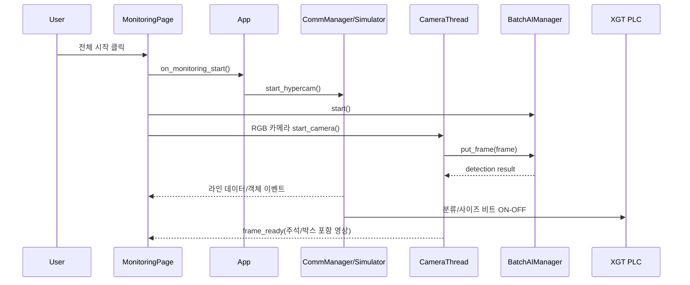
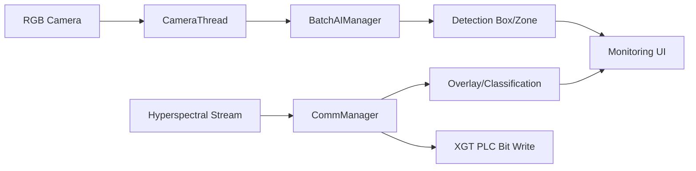

# AIO System

<p align="center">
  
</p>

산업용 플라스틱 선별 라인을 위한 `All-In-One` 모니터링/제어 애플리케이션입니다.  
UI에서 RGB 카메라, 초분광(라인스캔) 이벤트, AI 추론, PLC 신호 전송 흐름을 한 화면에서 다룹니다.

## 1. 한눈에 보기

| 항목 | 내용 |
| --- | --- |
| 메인 실행 파일 | `app.py` |
| UI 프레임워크 | `PySide6` |
| AI 추론 | `Ultralytics YOLO` + TensorRT(`best.engine`) |
| 실시간 영상 | RGB 2채널 + 초분광 1채널 |
| PLC 연동 | XGT TCP 패킷(`src/function/XGT_run.py`) |
| 기본 실행 모드 | 시뮬레이터 모드 (`_use_linescan_simulator=True`) |

## 2. 주요 기능

- 대시보드: 시스템 상태 카드, 인버터 모니터링 값, 시작/정지/리셋 버튼
- 모니터링: RGB 카메라 스트림, 초분광 라인 이미지, 실시간 분류 카운트
- 제어 패널: 전체 시작/정지, 녹화/스냅샷(버튼 UI), 해상도 선택, 배출 순서(1~3) 설정
- 로그/IO 체크: 입력(I00~I31)·출력(O00~O31) 비트 상태와 레벨별 로그 뷰
- 장애 로그: 크래시 발생 시 `log/crash_log_YYMMDD(...)_HHMMSS.txt` 자동 생성

## 3. UI 예시 (그림형)

### 3-1. 메뉴 아이콘

| 대시보드 | 모니터링 | 설정 | 로그 |
| --- | --- | --- | --- |
|  |  |  |  |

### 3-2. 전체 레이아웃

```text
┌──────────────────────────────────────────────────────────────────────────────┐
│ Header: 로고 | 탭(대시보드/모니터링/설정/로그) | 상태 라벨 | 현재 시간       │
├───────────────┬──────────────────────────────────────────────────────────────┤
│ Left Sidebar  │ Main Contents                                                │
│ - 페이지 제목 │ - 대시보드: 상태카드 + 제어 패널                            │
│ - 서브탭      │ - 모니터링: 제어바 + RGB 카메라들 + 초분광 + 분류 통계      │
│ - 긴급정지    │ - 로그: IO 체크/로그 화면 전환                              │
└───────────────┴──────────────────────────────────────────────────────────────┘
```

### 3-3. 대시보드 와이어프레임

```text
[시스템상태][알람][피더][컨베이어]   ← 상단 상태 카드

[withwe_0][정지 버튼][운전 상태]
┌─────────────────────────────────────────────────────────────┐
│ 출력 주파수 | 출력 전류 | 출력 전압 | DC Link | 출력 파워 │
│                                                     ...     │
│ [리셋] [정지] [시작]                                        │
└─────────────────────────────────────────────────────────────┘
```

### 3-4. 로그/IO 와이어프레임

```text
좌측 서브탭: [IO 체크] [로그]

IO 체크:
  Input(I00~I31)  |  Output(O00~O31)
  LED 점등으로 ON/OFF 표시

로그:
  레벨 필터(전체/정보/경고/에러) + 로그 지우기 + 저장(버튼)
  타임스탬프 포함 실시간 로그 텍스트
```

## 4. 동작 흐름 (다이어그램)

### 4-1. 모니터링 시작 시퀀스



### 4-2. 데이터 파이프라인



## 5. 폴더 구조

```text
AIO_system/
├─ app.py
├─ requirements.txt
├─ run_app.bat
├─ search/
│  ├─ search_ifname.py
│  └─ search_slave.py
├─ test/
│  ├─ ethercat_test.py
│  └─ serial_test.py
├─ src/
│  ├─ AI/
│  │  ├─ model/
│  │  │  ├─ best.engine
│  │  │  └─ weights/best.pt
│  │  ├─ cam/
│  │  ├─ tracking/
│  │  └─ AI_manager.py
│  ├─ function/
│  │  ├─ comm_manager.py
│  │  ├─ XGT_run.py
│  │  ├─ ethercat_manager.py
│  │  └─ modbus_manager.py
│  ├─ ui/
│  │  ├─ main_window.py
│  │  ├─ logo/
│  │  └─ page/
│  └─ utils/
│     ├─ config_util.py
│     └─ logger.py
└─ log/
```

## 6. 설치 및 실행

### 6-1. 사전 준비

- Windows 환경 권장 (Basler/pypylon, 장비 연동 코드 기준)
- Python 가상환경 생성
- `npcap-1.85.exe` 설치 (네트워크/저수준 장치 탐색 시 필요)

### 6-2. 의존성 설치

```powershell
python -m venv .venv
.\.venv\Scripts\Activate.ps1
pip install -r requirements.txt
```

### 6-3. 실행

```powershell
python app.py
```

## 7. 실행 모드

### 7-1. 시뮬레이터 모드 (기본)

`app.py`에서 `_use_linescan_simulator = True`가 기본값입니다.  
초분광 스트림/객체 이벤트가 가상 데이터로 생성되므로, UI와 로직을 장비 없이 확인할 수 있습니다.

### 7-2. 실장비 모드

1. `app.py`의 `_use_linescan_simulator = False` 변경
2. `src/utils/config_util.py` 값 점검
3. PLC IP/Port 점검 (`src/function/XGT_run.py`)
4. 카메라/워크플로우/네트워크 인터페이스 준비

## 8. 운영 전 필수 설정 포인트

| 파일 | 키/위치 | 설명 |
| --- | --- | --- |
| `app.py` | `_use_linescan_simulator` | 시뮬레이터/실장비 모드 전환 |
| `src/utils/config_util.py` | `HOST`, `COMMAND_PORT`, `EVENT_PORT`, `DATA_STREAM_PORT` | 초분광 런타임 통신 대상 |
| `src/utils/config_util.py` | `WORKFLOW_PATH` | Breeze Runtime 워크플로우 XML 경로 |
| `src/utils/config_util.py` | `CAMERA_CONFIGS` | RGB 카메라 ROI/Box/타겟 클래스 |
| `src/function/XGT_run.py` | `XGTTester(ip, port)` | PLC 접속 주소 |
| `search/search_ifname.py` | 실행 스크립트 | EtherCAT 네트워크 어댑터 이름 확인 |
| `search/search_slave.py` | `master.open(...)` | 실제 어댑터 이름으로 수정 후 슬레이브 점검 |

## 9. 테스트/점검 스크립트

```powershell
# EtherCAT 어댑터 목록
python search/search_ifname.py

# EtherCAT 슬레이브 탐색 (어댑터 문자열 수정 후)
python search/search_slave.py

# Modbus 직렬 테스트 예시
python test/serial_test.py
```

## 10. 로그 및 장애 대응

- UI 로그는 `Logger` 콜백으로 로그 탭에 실시간 반영됩니다.
- 크래시 로그는 `log/` 폴더에 생성됩니다.
- 빈 크래시 로그 파일은 종료 시 자동 정리됩니다.

## 11. 현재 코드 기준 참고사항

- `setting_page.py`는 현재 메인 윈도우에서 주석 처리 상태입니다.
- 일부 버튼 기능은 UI만 구현되어 있고 TODO 상태입니다.
- 예: 스냅샷 저장, 녹화 저장, 로그 저장 실제 파일 저장 로직
- `run_app.bat`는 특정 절대경로를 가리키므로 로컬 환경에 맞게 수정이 필요합니다.

## 12. 트러블슈팅

### 12-1. AI 모델 로드 실패

- 확인: `src/AI/model/best.engine` 경로 존재 여부
- 증상: 모니터링 UI는 열리지만 AI 감지가 동작하지 않음

### 12-2. Basler 카메라 연결 실패

- 코드상 OpenCV 카메라로 폴백 시도
- 장비 환경에서는 pypylon 드라이버와 카메라 인식 상태를 먼저 점검

### 12-3. 초분광 이벤트 미수신

- `HOST`/포트/워크플로우 경로 점검
- 런타임 서버가 실제로 `COMMAND/EVENT/DATA_STREAM` 포트를 열고 있는지 확인

### 12-4. PLC 비트 출력 안됨

- `XGTTester` IP/Port 확인
- 장비 네트워크 라우팅 및 방화벽 확인

---

필요하면 다음 단계로 `README`에 실제 현장 스크린샷(캡처 이미지) 섹션까지 추가해서 운영 매뉴얼 형태로 확장할 수 있습니다.
